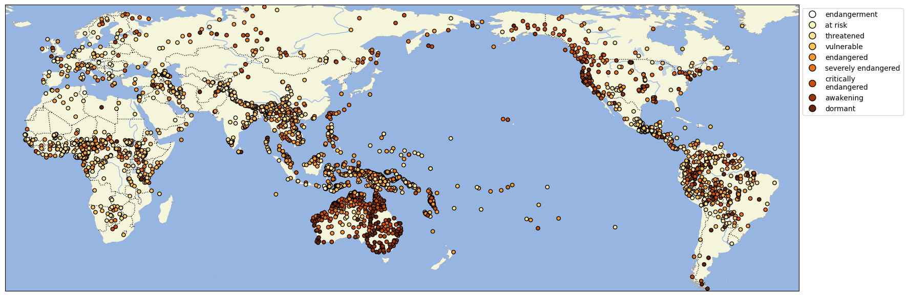

# The Catalogue of Endangered Languages as CLDF dataset

## How to cite

If you use these data please cite
- the original source
  > Catalogue of Endangered Languages. 2023. University of Hawaii at Manoa. http://www.endangeredlanguages.com
- the derived dataset using the DOI of the [particular released version](../../releases/) you were using

## Description


This dataset is licensed under a CC-BY-4.0 license

Available online at https://endangeredlanguages.com



### Parameters

This dataset contains three sets of [parameters](cldf/parameters.csv).
- The four categories from which the Language Endangerment Index is derived.
- The computed Language Endangerment Index.
- Parameters with composite JSON values. Below is a list of [JSON schemas](https://json-schema.org/) describing the values of these parameters.

#### context

```json
{
    "type": "object",
    "properties": {
        "Domains Other Langs": {
            "type": "array",
            "items": {
                "type": "string"
            }
        },
        "Government Support": {
            "type": "string"
        },
        "Institutional Support": {
            "type": "string"
        },
        "Number Speaker Other Languages": {
            "type": "string"
        },
        "Other Languages Used": {
            "type": "string"
        },
        "Speaker Attitude": {
            "type": "string"
        }
    }
}
```

#### location

```json
{
    "type": "object",
    "properties": {
        "Coordinates": {
            "type": "array",
            "items": {
                "type": "array",
                "prefixItems": [
                    {
                        "title": "latitude",
                        "type": "number",
                        "minimum": -90,
                        "maximum": 90
                    },
                    {
                        "title": "longitude",
                        "type": "number",
                        "minimum": -180,
                        "maximum": 180
                    }
                ]
            }
        },
        "Description": {
            "type": "string"
        },
        "Places": {
            "type": "array",
            "items": {
                "type": "string"
            }
        }
    }
}
```

#### speakers

```json
{
    "type": "object",
    "properties": {
        "Speaker Number Text": {
            "type": "string"
        },
        "Speaker Number": {
            "type": "string"
        },
        "Elders": {
            "type": "string"
        },
        "Ethnic Population": {
            "type": "string"
        },
        "Older Adults": {
            "type": "string"
        },
        "Second Language Speakers": {
            "type": "string"
        },
        "Semi Speakers": {
            "type": "string"
        },
        "Young Adults": {
            "type": "string"
        },
        "Date Of Info": {
            "type": "string"
        }
    }
}
```

#### vitality

```json
{
    "type": "object",
    "properties": {
        "Endangerment": {
            "type": "object",
            "properties": {
                "Level": {
                    "enum": [
                        "safe",
                        "at risk",
                        "vulnerable",
                        "threatened",
                        "endangered",
                        "severely endangered",
                        "critically endangered",
                        "awakening",
                        "dormant"
                    ]
                },
                "Certainty": {
                    "type": "number",
                    "minimum": 0,
                    "maximum": 1
                }
            }
        },
        "Domains Of Use": {
            "type": "string"
        },
        "Speaker Number Trends": {
            "type": "string"
        },
        "Transmission": {
            "type": "string"
        }
    }
}
```


## CLDF Datasets

The following CLDF datasets are available in [cldf](cldf):

- CLDF [StructureDataset](https://github.com/cldf/cldf/tree/master/modules/StructureDataset) at [cldf/StructureDataset-metadata.json](cldf/StructureDataset-metadata.json)